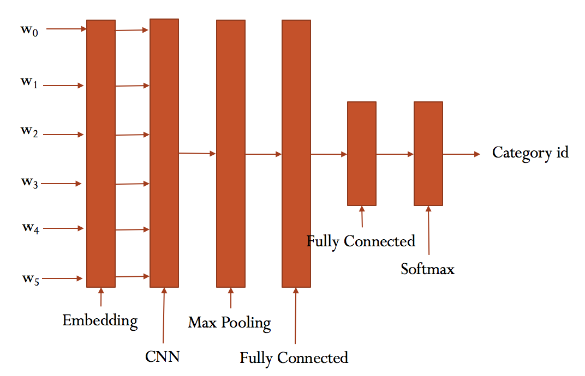

# Text Classification with CNN and RNN

使用卷积神经网络以及循环神经网络进行中文文本分类


## 环境

- Python 3
- TensorFlow 1.3以上
- numpy
- scikit-learn
- scipy

## 数据集

老师上课给的情感分析的数据集，从豆瓣提取的评论。

## 预处理

`data/cnews_loader.py`为数据的预处理文件。

- `read_file()`: 读取文件数据;
- `build_vocab()`: 构建词汇表，使用字符级的表示，这一函数会将词汇表存储下来，避免每一次重复处理;
- `read_vocab()`: 读取上一步存储的词汇表，转换为`{词：id}`表示;
- `read_category()`: 将分类目录固定，转换为`{类别: id}`表示;
- `to_words()`: 将一条由id表示的数据重新转换为文字;
- `process_file()`: 将数据集从文字转换为固定长度的id序列表示;
- `batch_iter()`: 为神经网络的训练准备经过shuffle的批次的数据。


## CNN卷积神经网络

### 配置项

CNN可配置的参数如下所示，在`cnn_model.py`中。

```python
class TCNNConfig(object):
    """CNN配置参数"""

    embedding_dim = 64      # 词向量维度
    seq_length = 600        # 序列长度
    num_classes = 3        # 类别数
    num_filters = 128        # 卷积核数目
    kernel_size = 5         # 卷积核尺寸
    vocab_size = 5000       # 词汇表达小

    hidden_dim = 128        # 全连接层神经元

    dropout_keep_prob = 0.5 # dropout保留比例
    learning_rate = 1e-3    # 学习率

    batch_size = 64         # 每批训练大小
    num_epochs = 10         # 总迭代轮次

    print_per_batch = 100    # 每多少轮输出一次结果
    save_per_batch = 10      # 每多少轮存入tensorboard
```

### CNN模型

具体参看`cnn_model.py`的实现。

大致结构如下：



### 训练与验证

运行 `python run_cnn.py train`，可以开始训练。


## RNN循环神经网络

### 配置项

RNN可配置的参数如下所示，在`rnn_model.py`中。

```python
class TRNNConfig(object):
    """RNN配置参数"""

    # 模型参数
    embedding_dim = 64      # 词向量维度
    seq_length = 600        # 序列长度
    num_classes = 3        # 类别数
    vocab_size = 5000       # 词汇表达小

    num_layers= 2           # 隐藏层层数
    hidden_dim = 128        # 隐藏层神经元
    rnn = 'gru'             # lstm 或 gru

    dropout_keep_prob = 0.8 # dropout保留比例
    learning_rate = 1e-3    # 学习率

    batch_size = 128         # 每批训练大小
    num_epochs = 10          # 总迭代轮次

    print_per_batch = 100    # 每多少轮输出一次结果
    save_per_batch = 10      # 每多少轮存入tensorboard
```

### RNN模型

具体参看`rnn_model.py`的实现。

大致结构如下：


### 训练与验证

> 这部分的代码与 run_cnn.py极为相似，只需要将模型和部分目录稍微修改。

运行 `python run_rnn.py train`，可以开始训练。

> 若之前进行过训练，请把tensorboard/textrnn删除，避免TensorBoard多次训练结果重叠。


## 预测

为方便预测，repo 中 `predict.py` 提供了 CNN 模型的预测方法。
